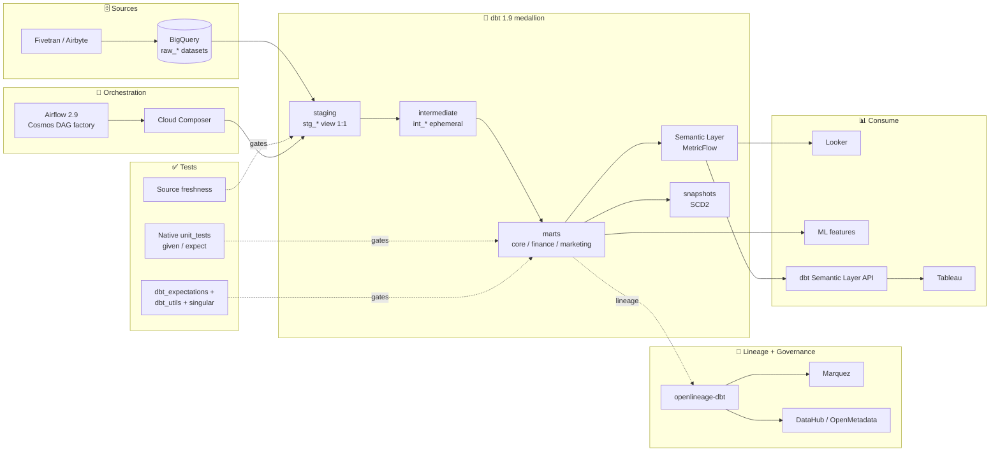
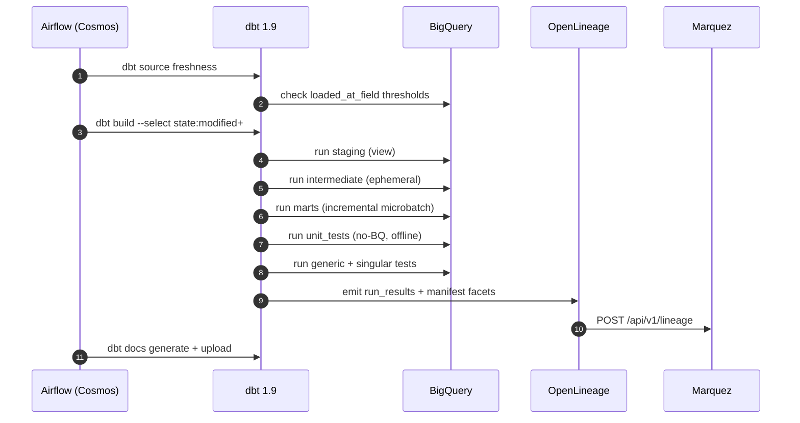

# Architecture

## Overview

A modern, opinionated **analytics engineering platform** built on the canonical dbt medallion pattern. Raw data lands in BigQuery via Fivetran; **dbt 1.9** transforms through three layers (bronze staging → silver intermediate → gold marts) with native **unit tests** + **microbatch incremental** strategy; a **dbt Semantic Layer / MetricFlow** binds marts to stable metric definitions consumed by BI; **Airflow (Cloud Composer)** orchestrates; **OpenLineage** events flow to Marquez / DataHub.

### dbt run lifecycle

## Design Decisions

### Why three layers (staging/intermediate/marts)?

- **Staging (stg_\*)**: 1:1 with raw tables, renamed + typed. Keeps vendor quirks isolated from business logic.
- **Intermediate (int_\*)**: reusable building blocks — joined/enriched tables that multiple marts need. Materialized as **ephemeral** so they compose into marts without extra storage.
- **Marts**: denormalized, domain-organized consumption layer. Partitioned + clustered for query performance.

If you skip intermediate and go straight staging → marts, you get either duplicated business logic (WET code) or one mega-mart that's impossible to test in isolation. Three layers is the consensus answer from the analytics-engineering community.

### Why ephemeral intermediate?

- They're used by exactly 1-2 downstream models each
- Materializing doubles storage for no query benefit
- The inliner keeps dbt's lineage graph readable without polluting BigQuery with rarely-queried tables

### Why snapshots instead of SCD2 inside the marts layer?

dbt snapshots have first-class support for **`check`-based change detection** (compare `check_cols` hashes) and **hard-delete invalidation**. Re-implementing this in marts SQL is verbose and error-prone.

### Why BigQuery (not Snowflake)?

Equivalent from a dbt-user's perspective. The specific picks here (partition + cluster syntax, MERGE strategy, `SAFE_CAST`) are BigQuery-native but the patterns translate 1:1 to Snowflake. This repo could be adapted to Snowflake by swapping `dbt-bigquery` → `dbt-snowflake` and adjusting 3-4 model configs.

### Why Cosmos instead of `BashOperator dbt run`?

- **Per-model Airflow tasks**: retry failed models individually, see lineage in Airflow UI, apply SLAs per model
- **Native parallelism**: Airflow's scheduler respects dbt's threading + its own executor pool
- **Observability**: Airflow logs tie to dbt's artifacts for full trace

### Incremental strategy: MERGE on BigQuery

- `merge` is ACID
- `unique_key` triggers the MERGE predicate
- `merge_update_columns` lets us update only fields that can change (e.g., `order_status`) while keeping immutable fields (`order_id`, `placed_at`) untouched

Alternative: `insert_overwrite`. Faster on time-series tables but loses the ability to update late-arriving rows.

### Clustering > Partitioning for high-cardinality predicates

- **Partition by** `order_date` (day): time-window queries only scan relevant partitions
- **Cluster on** `customer_id, order_status`: inside a partition, BigQuery uses block pruning to further reduce bytes scanned
- Combined: a query `WHERE order_date = '2026-04-21' AND customer_id = 12345` scans a handful of MB, not GB

### Schema routing: `bronze.stg_*`, `silver.int_*`, `gold.<domain>_*`

Custom `generate_schema_name` macro overrides dbt's default. Why?
- **Dev**: per-developer prefix (`dbt_sushma_bronze`) prevents dev-vs-prod collisions
- **Prod**: clean layer names (`bronze`, `silver`, `gold`) that mirror lakehouse terminology across warehouses

## Trade-offs

| Decision | Trade-off |
|---|---|
| Hourly build (not streaming) | Latency ~1h vs cost ~$50/month vs ~$500/month for streaming |
| Cloud Composer orchestration | Turn-key GCP vs ~$300/month minimum |
| Ephemeral intermediate | Storage-free vs can't be queried ad-hoc |
| dbt_project_evaluator enforcement | Strict style vs some legacy models fail initially |
| `check_cols` snapshots | Dialect-agnostic vs slower than `timestamp`-based |

## Operational Concerns

- **Freshness SLAs**: `loaded_at_field` + `warn_after` / `error_after` on every source
- **Incremental correctness**: `lookback_days` var caps the re-processing window
- **Audit trail**: `audit.dbt_run_log` populated via `on-run-end` hook
- **Cost governance**: query labels (`dbt-<version> | <invocation_id> | <model>`) make INFORMATION_SCHEMA cost attribution trivial
- **Exposures**: every mart documents its downstream consumers → impact analysis before any breaking change

## Reference

- [dbt best practices guide](https://docs.getdbt.com/best-practices)
- [Astronomer Cosmos](https://astronomer.github.io/astronomer-cosmos/)
- [BigQuery partitioned tables](https://cloud.google.com/bigquery/docs/partitioned-tables)
- [BigQuery clustered tables](https://cloud.google.com/bigquery/docs/clustered-tables)
